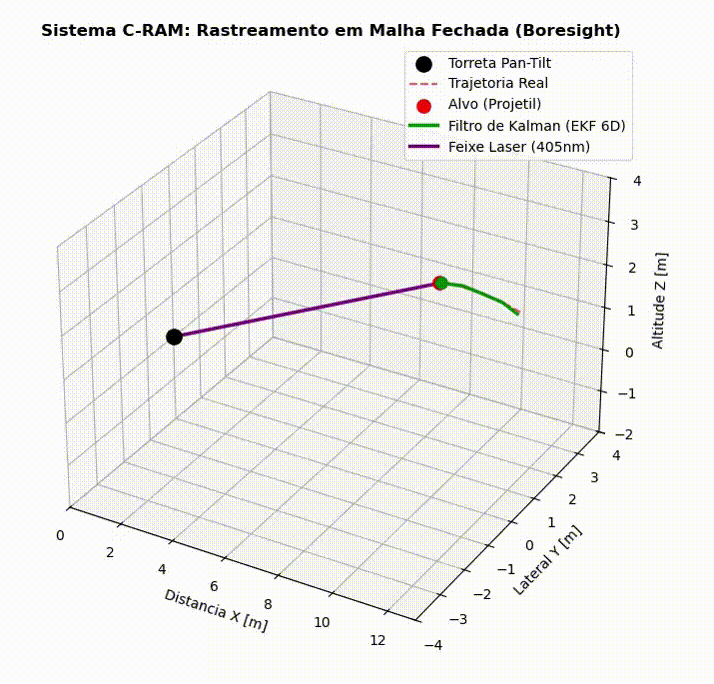
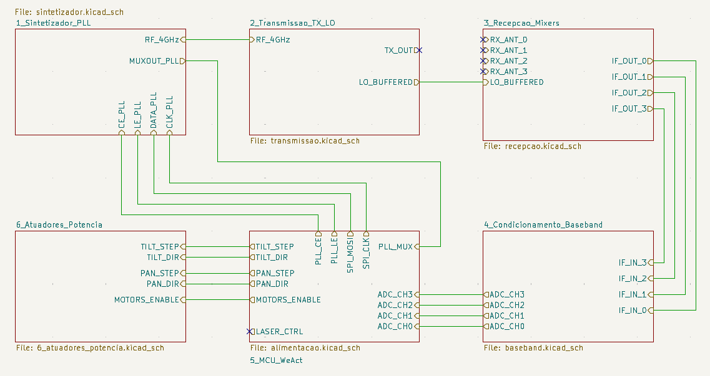

# 📡 FMCW Radar & Autonomous Pan-Tilt Tracker

> **Status do Projeto:** Fase de roteamento da PCB e testes de firmware HIL (Hardware-in-the-Loop).

## 🎯 Visão Geral
Este projeto consiste no desenvolvimento end-to-end (Hardware e Firmware) de um sistema de radar FMCW (Frequency-Modulated Continuous Wave) operando a 4 GHz. O sistema não apenas detecta a distância e a velocidade de alvos em movimento, mas utiliza um **Filtro de Kalman Estendido 6D (EKF)** para prever trajetórias balísticas e controlar uma torreta mecânica Pan-Tilt para rastreamento físico do alvo em tempo real.

## 🧠 Arquitetura do Sistema

### ⚡ Hardware (KiCad)
Projeto hierárquico modular focado em integridade de sinal e isolamento de RF:
* **Cérebro DSP:** STM32G474CEUx (via WeAct Studio Core Board).
* **Síntese de RF:** PLL ADF4158 para geração da rampa FMCW.
* **Baseband e Condicionamento:** Filtros ativos utilizando AmpOps RRIO OPA2365 de baixo ruído.
* **Controle Mecânico:** Drivers A4988 comandando motores de passo (microstepping de 1/16).
* **Power Management:** Distribuição isolada de 12V (Motores), 5V (RF via USB) e 3.3V (LDO/Lógica).

### 💻 Firmware (C++ / STM32Cube)
Arquitetura orientada a objetos projetada para processamento matemático restrito por tempo:
* **Aquisição Paralela:** Leitura síncrona dos 4 canais de RF via DMA a 1 MSPS (Double Buffering).
* **Processamento de Sinais:** Algoritmos de Range-Doppler e FFTs de 512 pontos com a biblioteca `CMSIS-DSP`.
* **Estimação de Estados:** EKF 6D fundindo dados interferométricos para rastreamento de alvos dinâmicos.
* **Telemetria:** Serialização binária via USB CDC (115200 bps) para o visualizador Python.

## 📂 Estrutura do Repositório
* 📁 `/Hardware` - Projeto completo no KiCad 8 (Esquemáticos, Lista de Materiais e DRC).
* 📁 `/Firmware` - Workspace do STM32CubeIDE com o código-fonte modular em C++.

---
Desenvolvido com ☕ e Matemática aplicada à Engenharia.
